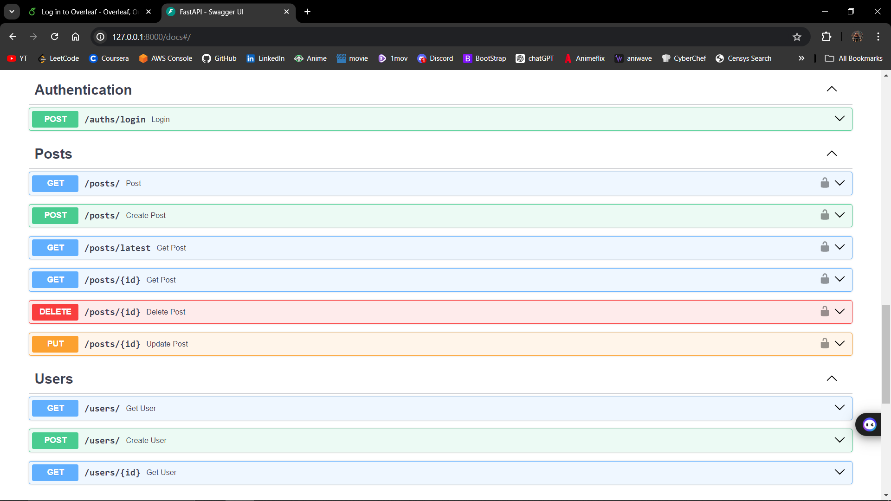

# FastApi
- Api app which is used to create User and Post
- User can be authenticated by using email and password
- User are provided with jwt token which is essential for all operations

#API Overlook
- API's

 
- API Schema

